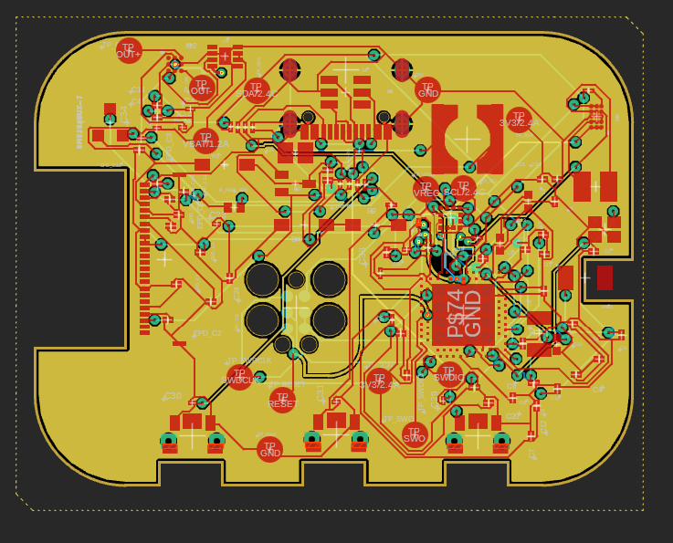
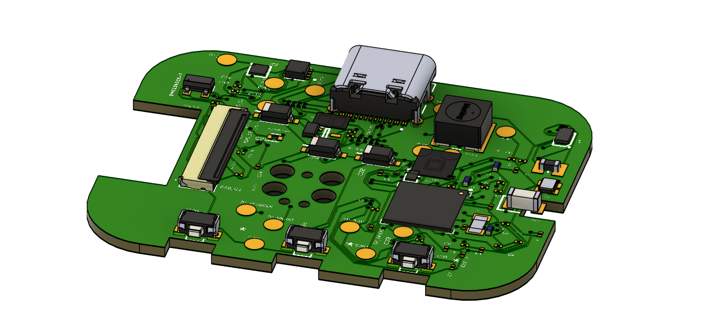
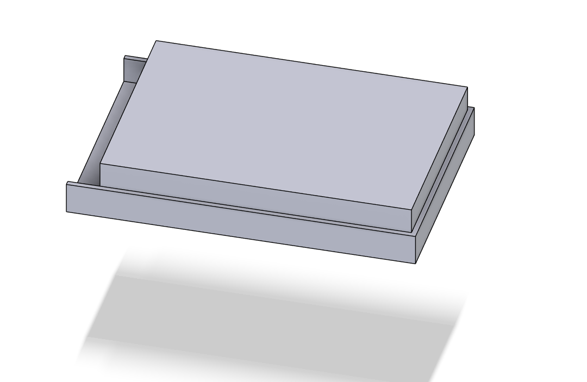
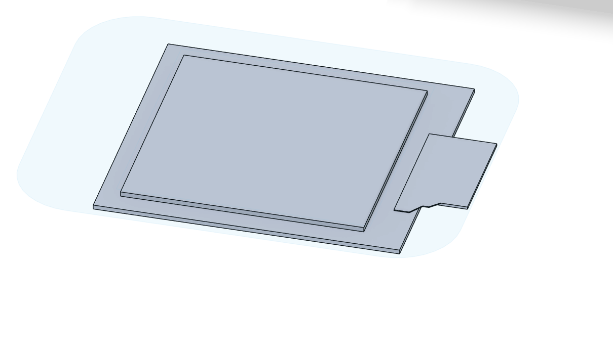
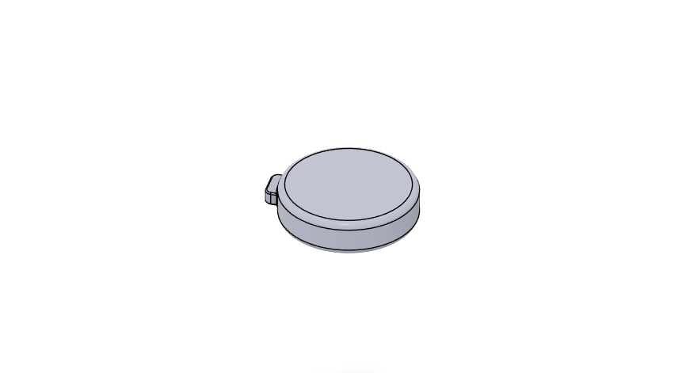

# Watch_TSC_Project

> Ceas inteligent open-source bazat pe nRF52840 cu display E-Paper, proiectat în Autodesk Fusion.

---

## Descriere generală

**Watch_TSC_Project** este un ceas inteligent proiectat în jurul microcontroller-ului **nRF52840**, care utilizează un display E-Paper (cerneală electronică) pentru afișarea orei și a altor informații. Proiectul include design complet de schematic, PCB pe 4 straturi și modelare 3D a ansamblului, realizate în Autodesk Fusion.

Principalele caracteristici:
- Microcontroller nRF52840 cu Bluetooth 5.0 și procesor ARM Cortex-M4
- Display E-Paper conectat prin SPI
- Accelerometru/IMU pentru detecția mișcării (step counter, wake-on-wrist)
- Baterie LiPo cu circuit de încărcare dedicat
- Regulator DC/DC pentru tensiune stabilă de 3.3V
- Fuel Gauge pentru monitorizarea nivelului bateriei
- Driver haptic pentru feedback vibrotactil
- Protecție ESD pe linia USB-C
- Conectivitate USB-C pentru încărcare și programare
- 3 butoane fizice pentru interacțiune

---

## Diagrama bloc

```
                         +-------------------+
                         |    Baterie LiPo   |
                         +--------+----------+
                                  |
                         +--------v----------+
                         |  LiPo Charger     |  <-- USB-C (5V / VBUS)
                         |  BQ25180YBGR      |
                         +--------+----------+
                                  | VBAT (3.7-4.2V)
                         +--------v----------+
                         |  Fuel Gauge        |  <-- I2C --> nRF52840
                         |  MAX17048G+T10     |
                         +--------+----------+
                                  |
                         +--------v----------+
                         |  DC/DC Regulator  |  <-- I2C --> nRF52840
                         |  RT6160AWSC       |
                         +--------+----------+
                                  | 3V3
          +-----------------------+-----------------------+
          |                       |                       |
+---------v---------+   +---------v---------+   +---------v---------+
|   nRF52840 (U1)   |   |  ESD Protection   |   |   Butoane (x3)    |
|   Microcontroller |   |  USBLC6-2SC6Y     |   |   EVP-AKE31A      |
+---------+---------+   +-------------------+   +-------------------+
          |
    +-----+------+------+------+
    |            |      |      |
+---v---+  +----v--+  +-v---+ +--v---------+
| SPI   |  |  I2C  |  | SWD | | GPIO/ANT   |
+---+---+  +---+---+  +-----+ +------------+
    |          |
+---v---+  +---v---------+--------+
|E-Paper|  |    IMU      | Haptic |
|Display|  |   BMA423    |DRV2605 |
+-------+  +-------------+--------+
```

---

## Bill of Materials (BOM)

| Cantitate | Componentă | Descriere | Referință |
|:---------:|:----------:|:---------:|:---------:|
| 1 | nRF52840 | Microcontroller ARM Cortex-M4, BT 5.0 | U1 |
| 1 | BQ25180YBGR | LiPo Charger IC, 8-DSBGA | IC1 |
| 1 | DRV2605YZFR | Haptic Driver ERM/LRA, 9-BGA | IC2 |
| 1 | BMA423 | IMU Accelerometru triaxial 12-bit | IC3 |
| 1 | MAX17048G+T10 | Fuel Gauge 1-Cell ModelGauge | U3 |
| 1 | RT6160AWSC | Buck-Boost DC/DC Regulator I2C, 15-WL-CSP | IC9 |
| 1 | USBLC6-2SC6Y | ESD Protection TVS Diode, SOT-23-6 | D3 |
| 1 | KH-TYPE-C-16P | Conector USB-C 16 pini | J4 |
| 1 | 503480-2400 | Conector FPC/FFC 0.5mm 24 circuite | J1 |
| 1 | DMG2305UX-7 | P-Channel MOSFET 20V/4.2A SOT-23 | Q2 |
| 1 | SI1308EDL-T1-GE3 | N-Channel MOSFET 30V/1.5A SC-70 | Q3 |
| 3 | MBR0530 | Diodă Schottky 30V/500mA SOD-123 | D1, D2, D5 |
| 3 | EVP-AKE31A | Buton tactil SMD ultra-subțire | SW_DN, SW_ENT, SW_UP |
| 1 | 2450AT18B100E | Antenă 2.45GHz SMD | ANT1 |
| 1 | FTC252012SR47MBCA | Inductor SMD 0.47uH 2016 | L7 |
| 1 | 744043680 | Inductor SMD 68uH WE-TPC | L5 |
| 1 | TC2030-IDC | Conector Tag-Connect 6 pini SWD | J2 |
| 1 | X1 (32MHz) | Crystal 32MHz 2016 SMD | X1 |
| 1 | X2 (32.768kHz) | Crystal 32.768kHz 3215 SMD | X2 |
| ~50 | Condensatoare SMD | 0201/0402, diverse valori (1pF - 22uF) | Cx |
| ~15 | Rezistoare SMD | 0201, diverse valori (2.2Ω - 10kΩ) | Rx |
| ~4 | Inductoare SMD | 0402, diverse valori (3.9nH - 15nH, 10uH) | Lx |
| 14 | Test Pad TP20R | Test pad-uri SMD 2mm | TP_* |
| 1 | Solder Jumper SJ | Jumper SMD | SJ1 |

---

## Descrierea funcționalității hardware

### Interfețe de comunicație
- **I2C**: LiPo Charger, DC/DC, IMU, Fuel Gauge, Haptic Driver
- **SPI**: E-Paper Display Connector

### Componente și roluri

**nRF52840**
Microcontroller-ul principal care coordonează întreaga funcționalitate a plăcii. Conține un procesor ARM Cortex-M4 la 64MHz cu FPU, 1MB Flash, 256KB RAM, radio BT 5.0 integrat și USB 2.0 Full Speed nativ.

**IMU (Accelerometru) — BMA423**
Măsoară accelerația pe cele trei axe. Folosit pentru detecția mișcării pumnului (wake-on-wrist), numărarea pașilor (step counter) și detecția orientării ceasului. Comunică cu nRF52840 prin I2C (adresă 0x18). Consum: 130μA în modul normal, 0.9μA în low-power mode.

**LiPo Charger — BQ25180**
Responsabil pentru încărcarea bateriei. Charger liniar programabil via I2C (adresă 0x6A), curent de încărcare configurabil 5mA–1A, tensiune 3.5V–4.65V. Semnalul CHARGER_PG notifică nRF52840 când alimentarea USB este validă.

**DC/DC — RT6160**
Stabilizator de tensiune ce furnizează 3.3V stabili întregii plăci, indiferent de tensiunea bateriei (3.7–4.2V). Regulator Buck-Boost bidirectional programabil via I2C (adresă 0x62), curent maxim 800mA, eficiență tipică ~90%.

**E-Paper Drive Circuit**
Controlează funcționarea display-ului E-Paper. Display-ul este conectat prin conectorul FPC/FFC J1 (503480-2400, 0.5mm pitch, 24 circuite) și comunică cu nRF52840 prin SPI (write-only, fără MISO), frecvență maximă 4MHz.

**Fuel Gauge — MAX17048**
Monitorizează nivelul de încărcare al bateriei prin algoritmul ModelGauge, fără rezistor shunt. Raportează procentul de încărcare și tensiunea celulei prin I2C (adresă 0x36). Consum sub 23μA.

**Haptic Driver — DRV2605**
Controlează vibrațiile actuatorului (shaker). Driver pentru actuatoare ERM și LRA cu 123 efecte predefinite, controlat via I2C (adresă 0x5A). Pinul HAPTIC_EN controlează pornirea/oprirea driver-ului.

**USB-C Connector — KH-TYPE-C-16P**
Asigură interfața de conectare USB pentru încărcare și programare. VBUS (5V) alimentează direct LiPo Charger-ul BQ25180.

**ESD Protection — USBLC6-2SC6Y**
Protejează placa împotriva descărcărilor electrostatice pe liniile D+ și D- USB. TVS diodă bidirecțională cu protecție ±15kV și capacitate parazită de doar 1pF.

---

### Calcul consum de energie (estimat)

| Componentă | Consum tipic | Mod |
|:----------:|:------------:|:---:|
| nRF52840 | 4.82mA | RX activ BT |
| nRF52840 | 6.26mA | TX activ BT |
| nRF52840 | 1.5μA | Deep sleep |
| BMA423 | 130μA | Normal |
| BMA423 | 0.9μA | Low power |
| MAX17048 | 23μA | Activ |
| DRV2605 | 5mA | Vibrație activă |
| Display E-Paper | ~26mA | Refresh |
| Display E-Paper | 0μA | Standby (retenție imagine) |
| RT6160 (DC/DC) | ~10mA | Consum propriu la 3.3V/100mA |

**Consum mediu estimat** (BT conectat, display în standby): ~6–8mA la 3.3V.
**Autonomie estimată** cu baterie LiPo 300mAh: ~35–50 ore în utilizare normală.

---

## Pinii nRF52840

Tabelul de mai jos descrie alocarea pinilor microcontroller-ului:

| Pin nRF52840 | Semnal | Modul conectat | Interfață | Descriere |
|:------------:|:------:|:--------------:|:---------:|:---------:|
| VDD | 3V3 | Alimentare | - | Alimentare la 3.3V |
| VSS | GND | Masă | - | Referință de masă |
| P0.02/AIN0 | SCK | E-Paper Display | SPI | Clock serial SPI |
| P0.03/AIN1 | MOSI | E-Paper Display | SPI | Date către display (Master Out Slave In) |
| P0.05/AIN3 | CS | E-Paper Display | SPI | Chip Select display |
| P0.15 | EPD_RST | E-Paper Display | GPIO | Reset display |
| P0.16 | EPD_DC | E-Paper Display | GPIO | Data/Command select |
| P0.17 | EPD_BUSY | E-Paper Display | GPIO | Stare ocupată display |
| P0.06 | SCL | IMU, LiPo Charger, DC/DC, Fuel Gauge, Haptic | I2C | Clock linie I2C |
| P0.07 | SDA | IMU, LiPo Charger, DC/DC, Fuel Gauge, Haptic | I2C | Date linie I2C |
| P0.08 | IMU_INT2 | BMA423 | GPIO | Întrerupere 2 accelerometru |
| P1.08 | IMU_INT1 | BMA423 | GPIO | Întrerupere 1 accelerometru |
| P0.10/NFC2 | FUELGAUGE_ALT | MAX17048 | GPIO | Alarmă nivel scăzut baterie |
| P0.11 | CHARGER_PG | BQ25180 | GPIO | Semnal Power Good charger |
| P0.12 | HAPTIC_EN | DRV2605 | GPIO | Enable driver haptic |
| P0.13 | BTN_UP | SW_UP | GPIO | Buton sus |
| P0.14 | BTN_ENT | SW_ENT | GPIO | Buton enter/confirmare |
| P1.02 | BTN_DN | SW_DN | GPIO | Buton jos |
| D+ | USB_DP | USB-C / ESD | USB | Date USB diferențiale pozitive |
| D- | USB_DM | USB-C / ESD | USB | Date USB diferențiale negative |
| VBUS | 5V USB | LiPo Charger | - | Alimentare 5V din USB |
| SWDIO | SWDIO | TC2030-IDC (J2) | SWD | Date programare/debug |
| SWDCLK | SWDCLK | TC2030-IDC (J2) | SWD | Clock programare/debug |
| SWO | SWO | TC2030-IDC (J2) | SWD | Trace output |
| P0.18/RESET | RESET | TC2030-IDC (J2) | GPIO | Reset hardware microcontroller |
| ANT | RF | 2450AT18B100E | RF | Antenă Bluetooth 2.4GHz |
| XC1, XC2 | XTAL_32M | X1 (32 MHz) | Clock | Sursă de ceas principală |
| XL1, XL2 | XTAL_32K | X2 (32.768 kHz) | Clock | Sursă de ceas RTC (low power) |
| DEC1-DEC5 | GND | - | - | Condensatoare decuplare regulatoare interne |

---

## Design PCB și modelare 3D

### Stackup PCB — 4 straturi

Placa a fost realizată pe **4 straturi** pentru a asigura integritate de semnal bună și o rutare curată:

| Strat | Rol |
|-------|-----|
| Top (L1) | Rutare semnal + componente SMD |
| L2 | Plan de masă (GND) |
| L3 | Plan de 3.3V (VCC) |
| Bottom (L4) | Rutare semnal secundar |

Avantajele acestui stackup:
- Planul de masă L2 oferă un return path scurt pentru toate semnalele de pe L1
- Planul de 3.3V L3 reduce impedanța de alimentare și EMI
- Via-urile de semnal au return path minim între straturile adiacente

### Decizii de design notabile

**Antenă și decupaj PCB** — Antena 2450AT18B100E este poziționată în colțul plăcii. Sub jumătatea neconectată electric a antenei s-a realizat un **decupaj al substratului** (cutout) pentru a îmbunătăți performanța de radiație și a evita absorbția de semnal RF de către materialul FR4.

**Via-in-pad** — Pentru componentele BGA (BQ25180, RT6160, DRV2605, MAX17048) cu pitch mic, s-au folosit **via-in-pad** — via-uri plasate direct sub pad-urile componentelor. Această tehnică permite rutarea semnalelor în spațiu limitat, dar necesită umplere cu rășină (plugged vias) pentru a asigura planitate la lipire.

**Test pad-uri** — Sunt prevăzute 14 test pad-uri (TP20R) pentru toate semnalele importante: 3V3, VBAT, GND, SDA, SCL, SWDCLK, SWDIO, SWO, RESET, VREG. Acestea facilitează testarea și depanarea după asamblare.

**Conexiuni baterie și shaker** — Bateria LiPo și motorul haptic (shaker) sunt conectate la PCB prin fire sudate pe test pad-urile dedicate (TP_VBAT, TP_VBAT_GND, respectiv pad-urile haptic driver-ului).

### Modelare 3D

Modelarea 3D a ansamblului ceasului a fost realizată în **Autodesk Fusion** și include:

- PCB 3D cu toate componentele plasate și orientate corect
- Baterie LiPo cu fire de legătură
- Display E-Paper cu conector FPC/FFC
- Shaker (motor haptic) cilindric
- Carcasă inferioară și cadru superior de retenție display
- Exploded View — vedere explodată verticală a ansamblului complet

---

## Imagini

### PCB 2D



### PCB 3D



### Ceas asamblat


### Exploded View


### Baterie



### Display E-Paper



### Shaker (Motor Haptic)



---

## Structura proiectului

```
Watch_TSC_Project/
├── Hardware/
│   ├── schematic.sch
│   ├── board.brd
│   └── schematic.pdf
├── Manufacturing/
│   ├── gerbers.zip
│   ├── bom.bom
│   └── pnp.cpl
├── Mechanical/
│   ├── assembly_exploded.step
│   └── Watch_TSC_Project.f3z
├── Images/
│   ├── 2D_PCB.png
│   ├── 3D_PCB.png
│   ├── Baterie3D.png
│   ├── Ceas_3D_asamblat.png
│   ├── Display3D.png
│   ├── Exploded_view.png
│   └── Shaker3D.png
├── LICENSE
└── README.md
```

---

## Licență

Copyright 2026 Stoenescu Constantin-Andrei

Distribuit sub licența **MIT**. Vezi fișierul [LICENSE](LICENSE) pentru detalii complete.